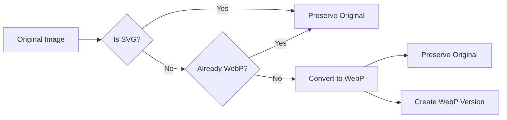
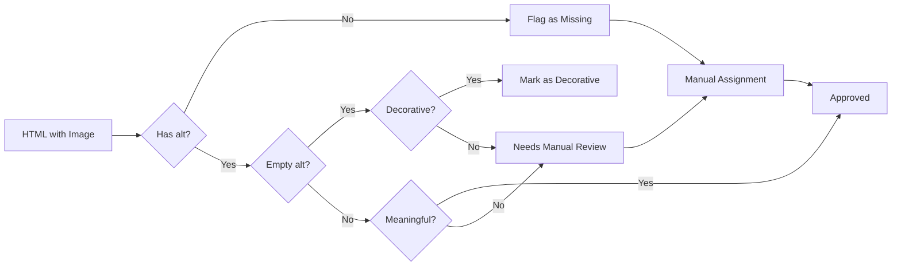

# Data Model: Image WebP Optimization

**Feature**: 001-image-webp-optimization
**Date**: 2026-01-05

## Overview

This feature optimizes static website images through WebP conversion, accessibility improvements (alt-text), and layout stability (dimensions). Since this is a static website optimization, there is no persistent data model. This document describes the HTML structure and image metadata that will be manipulated.

## HTML Structure

### Image Element

```html

```

**Attributes**:

- `src`: Path to image file (WebP format preferred)
- `alt`: Text description of image content for accessibility (required)
- `width`: Image width in pixels (required for layout stability)
- `height`: Image height in pixels (required for layout stability)
- `loading`: Loading behavior (e.g., "lazy" for below-fold images)

### Decorative Image

```html

```

**Special Attributes**:

- `alt=""`: Empty alt-text for decorative images (screen readers skip)
- `role="presentation"`: Additional accessibility marker (optional but recommended)

### Alternative: Aspect Ratio CSS

```html
<div class="image-container" style="aspect-ratio: 4/3;">
  
</div>
```

## Image Metadata Structure

### Image File Metadata

**Source**: Extracted from image file headers using Sharp

```typescript
interface ImageMetadata {
  // Basic information
  width: number; // Pixel width
  height: number; // Pixel height
  format: string; // File format (jpeg, png, gif, webp, svg)
  formatName: string; // Human-readable format name

  // Aspect ratio
  aspectRatio: number; // Width / height (e.g., 1.333 for 800x600)
  aspectRatioString: string; // Simplified ratio (e.g., "4:3", "16:9")

  // File information
  size: number; // File size in bytes
  path: string; // Relative file path

  // Quality metrics
  quality?: number; // Compression quality (for WebP)

  // Conversion status
  originalFormat?: string; // Original format if converted
  converted?: boolean; // Whether this is a WebP conversion
}
```

### Alt-Text Metadata

**Source**: Manual assignment with audit tracking

```typescript
interface AltTextAudit {
  // Image identification
  imagePath: string; // Path to image file
  htmlFile: string; // HTML file where image is used
  lineNumber: number; // Line number in HTML file

  // Alt-text status
  hasAltText: boolean; // Whether alt attribute exists
  altText?: string; // Alt-text content (if present)
  isDecorative: boolean; // Whether image is decorative
  needsReview: boolean; // Flag for manual review

  // Context
  context?: string; // Image context (e.g., "hero banner", "product photo")
  description?: string; // Content description for human reviewers
}
```

## File Structure

### Original Images (Before Conversion)

```text
assets/
├── images/
│   ├── photo1.jpg
│   ├── photo2.png
│   ├── logo.gif
│   └── icon.svg
```

### After WebP Conversion

```text
assets/
├── images/
│   ├── photo1.jpg           // Original preserved
│   ├── photo1.webp          // WebP version created
│   ├── photo2.png           // Original preserved
│   ├── photo2.webp          // WebP version created
│   ├── logo.gif             // Original preserved
│   ├── logo.webp            // WebP version created
│   └── icon.svg             // SVG unchanged
```

### HTML References (After Optimization)

```html
<!-- Preferred: WebP with fallback -->
<picture>
  <source srcset="assets/images/photo1.webp" type="image/webp" />
  
</picture>

<!-- Alternative: WebP only (if browser support assured) -->

```

## Validation Rules

### Image Conversion

1. **Format Eligibility**:
   - Convert: JPEG, PNG, GIF (non-animated)
   - Skip: SVG, animated GIF
   - Skip: Already WebP

2. **Quality Preservation**:
   - Visual quality must be acceptable to human viewers
   - Target file size reduction: 25%+ vs original

3. **Aspect Ratio**:
   - Must preserve exact original dimensions
   - No cropping or resizing during conversion

### Alt-Text

1. **Required for Non-Decorative Images**:
   - Must not be empty
   - Must describe image content accurately
   - Must include all text visible in image

2. **Decorative Images**:
   - Use alt=""
   - Add role="presentation" for clarity
   - Example: decorative icons, spacers, backgrounds

3. **Quality Standards**:
   - Concise but descriptive (10-125 characters recommended)
   - No file names (e.g., "photo1.jpg")
   - No redundant phrases (e.g., "Image of...", "A picture showing...")

### Dimension Attributes

1. **Required for All Images**:
   - width and height attributes, OR
   - aspect-ratio CSS, OR
   - Both (recommended for robustness)

2. **Accuracy**:
   - Must match actual image dimensions exactly
   - Must not be estimated or rounded

3. **Layout Stability**:
   - Must prevent Cumulative Layout Shift (CLS)
   - Space must be reserved before image loads

## State Transitions

### Image Conversion Process



### Alt-Text Process



## Testing Data

### Sample Images for Validation

| Image             | Format | Dimensions | Context             | Expected Alt-Text                                                      |
| ----------------- | ------ | ---------- | ------------------- | ---------------------------------------------------------------------- |
| hero-banner.jpg   | JPEG   | 1920x1080  | Main page header    | "U-2 spy plane flying over desert landscape at sunset"                 |
| product-photo.png | PNG    | 800x600    | Product detail page | "Front view of U-2 spy plane model kit box"                            |
| logo.gif          | GIF    | 200x50     | Website header      | Decorative (alt="")                                                    |
| info-graphic.jpg  | JPEG   | 1200x800   | About page          | "Infographic showing U-2 reconnaissance timeline from 1955 to present" |

### Success Metrics Tracking

```typescript
interface OptimizationMetrics {
  // Conversion metrics
  totalImages: number;
  convertedImages: number;
  conversionRate: number; // Target: 100%
  avgSizeReduction: number; // Target: 25%+

  // Alt-text metrics
  imagesWithAltText: number;
  altTextCompliance: number; // Target: 100%
  decorativeImages: number;

  // Dimension metrics
  imagesWithDimensions: number;
  dimensionCompliance: number; // Target: 100%

  // Performance metrics
  avgPageLoadTimeBefore: number;
  avgPageLoadTimeAfter: number;
  loadTimeImprovement: number; // Target: 20%+

  avgCLSBefore: number;
  avgCLSAfter: number;
  clsImprovement: number; // Target: <0.1
}
```

## Notes

- This data model describes static HTML attributes and image metadata, not a database
- All transformations are performed at build time via scripts
- Original image files are preserved alongside WebP versions
- Alt-text assignment is a manual process with automated audit support
